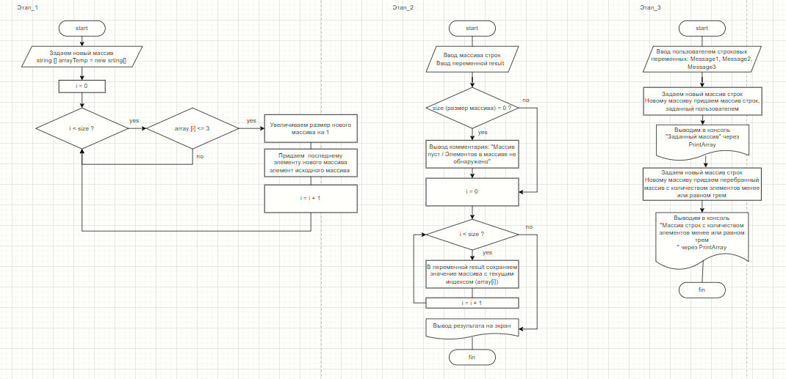

*Выполнение итогового проекта по результатам первого блока обучения*

## Что необходимо сделать в рамках проекта?
**1. Создать репозиторий на GitHub**

Результат: [Ссылка на репозиторий](https://github.com/Aleksandra-creator/Final-project.git)

**2. Нарисовать блок-схему алгоритма**

Результат: 

**3. Снабдить репозиторий оформленным текстовым описанием решений (файл README.md)** 

Результатом является этот описывающий задание файл

Результатом является текущий файл

**4. Написать программу, которая дана в задании**

*Описание программы:*

*Написать программу, которая из имеющегося массива строк формирует массив из строк, длина которых меньше или равна 3 символа. Первоначальный массив можно ввести с клавиатуры, либо задать на старте выполнения алгоритма. При решении не рекомендуется пользоваться коллекциями, лучше обойтись исключительно массивами.*

Результат: код находится в текущем репозитории

**5. Использовать контроль версий в работе над этим небольшим проектом (не должно быть так, что все залито единым коммитом, как минимум этапы 2, 3 и 4 должны быть расположены в разных коммитах)**

Результат: реализовано при подготовке данного файла
Создано несколько веток и внесена дополнительная информация в итоговый файл
